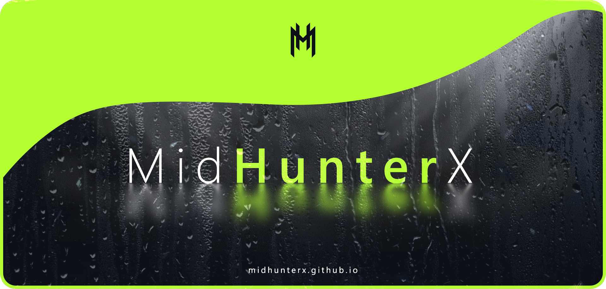

# Greetings &nbsp; <span></span>


I, denominated as Mid, do hereby present myself in the vocation of a Software Engineer. My predilections incline towards the pursuit of erudition, wherein I ardently indulge in the acquisition of knowledge, paired with the audacious enterprise of experimentation upon nascent technological paradigms. Additionally, my proclivities extend to the constructive endeavor of fabricating diminutive undertakings, thereby encapsulating my proclivity for innovation and application within the realm of software development.

## <span></span> &nbsp; Individualistic Impetus

- Engaging in a persistent and concerted effort towards the comprehensive assimilation of the amalgamated totality of human experience, a pursuit that is fraught with the probability of eluding fruition within the span of a single mortal existence.
- In persuit of adroit mastery through the observation and comprehension of actions of distinct inhabitants of this celestial entity and implementing the contemplated formulated logic pattern to the complications which commences throughout the course of existence.

<br>

<div align="center">

```

.    o.        .o    .
-`   yyo      oyy   `-
oNo` yyy      yyy `oNo
oMMNsyyy      yyysNMMo
oMMMMyyy      yyyMMMMo
oMMhdyyyy.  .yyyyyyMMo
oMMo yyyMMyyMMyyy oMMo
oMMo yyysNMMNoyyy oMMo
oMMo yyy `++` yyy oMMo
oMMo yyy      yyy oMMo
oMMo oyy      yyo oMMo
oMMo  .o      o.  oMMo
oMMo              oMMo
:NMo              oMN:
 `o+              +o`

```

</div>

## <span></span> &nbsp; Inclinations

- ⌨️ Technology and Software: Systematic investigation into human made equipments developed from the application of scientific knowledge and its underlying logical pattern, in order to establish facts and reach new conclusions of the working mechanism of aforementioned equipments.
- 🖌️ Graphic Design: Crafting digital visual content intended to transmit specific messages achieved through applying comprehensive logically formulated style of visual hierarchy, typeface and page layout of visual elements.
- 🌐 Engrish: Formulation of obfuscatory sesquipedalian lexicological formations and elaboration of convoluted circumlocutions using the English lexicon.
- ✍️ Physical/Digital Art
- 🔒 Computer Security

<br>

## <span></span> &nbsp; Tools and Technologies

### Languages

<span></span>
<span></span>
<span></span>
<span></span>
<span></span>
<span></span>
<span></span>
<span></span>
<span></span>

### Databases and Frameworks

<span></span>
<span></span>
<span></span>
<span></span>
<span></span>
<span></span>
<span></span>

### Development Tools

<span></span>
<span></span>
<span></span>
<span></span>
<span></span>
<span></span>

### Misc Tools

<span></span>
<span></span>
<span></span>
<span></span>
<span></span>
<span></span>

<br>

## <span></span> &nbsp; Find me around the Internet

[][instagram]
[][youtube]
[][spotify]
[][reddit]

<br clear="left">

<hr>

<sub><h6 align="center">This <i>README</i> file is generated through conversion from electrical pulses in the encephalon located inside the cranium of personal posession to this world wide web service using character encodings produced by a complex silicon based computing system <br/> <a title="Not even a copyright symbol but, okay... looks cool tho" href="https://matias.ma/nsfw/">ⓔ 2020 Mid Hunter</a></h6></sub>

<!-- Variables : Social -->

[youtube]: https://www.youtube.com/watch?v=dQw4w9WgXcQ
[instagram]: https://www.instagram.com/mid_hunter
[spotify]: https://open.spotify.com/user/8u1o1bw0zdxbfvgreer5xmeoa
[reddit]: https://www.reddit.com/user/MidHunterX
[discord]: https://discord.com/invite/KQxxEyu
